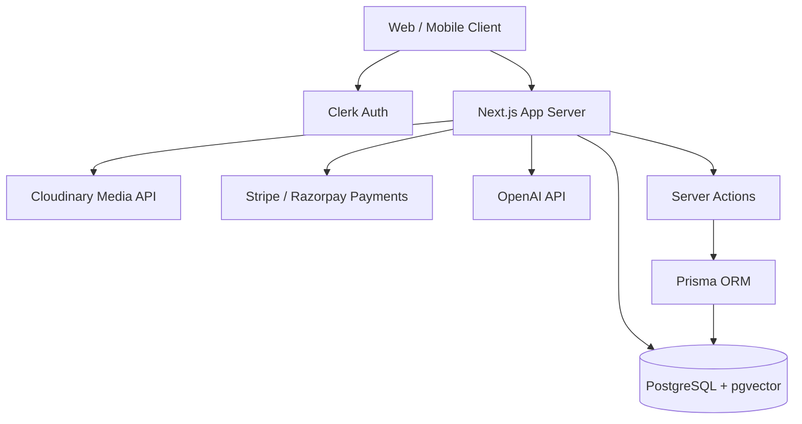
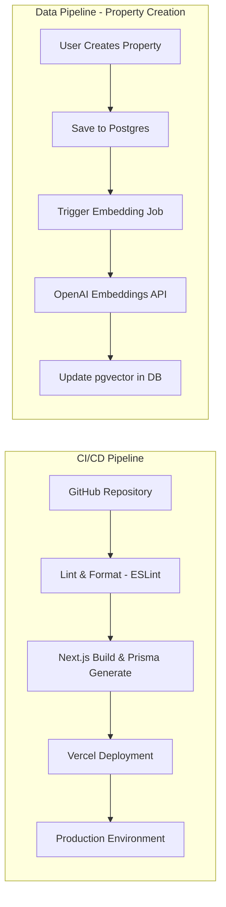

# Occupyo - Master Project Documentation

## 1. Executive Summary & Product Vision
**Occupyo** is a modern, full-stack real estate and commercial space management platform. It allows property owners to list spaces (warehouse, flex, office) and tenants to search, book, and lease these spaces dynamically. 
The platform aims to reduce friction in commercial real estate by supporting flexible leasing arrangements (hourly, daily, monthly), AI-powered semantic search, integrated payments, and real-time communication.

---

## 2. Technology Stack
- **Frontend Framework:** Next.js (App Router), React 19
- **Styling:** Tailwind CSS (v4), Lucide React (Icons), clsx & tailwind-merge
- **Database:** PostgreSQL (with `pgvector` extension for AI search)
- **ORM:** Prisma
- **Authentication:** Clerk (`@clerk/nextjs`)
- **Media Storage:** Cloudinary (`next-cloudinary`)
- **Payments:** Stripe (`@stripe/stripe-js`) & Razorpay
- **AI & Search:** OpenAI (for embeddings)
- **Form Management:** React Hook Form + Zod (Validation)
- **Mobile/Cross-Platform:** Capacitor (iOS/Android support via `@capacitor/core`)
- **Data Visualization:** Recharts

---

## 3. System Architecture



### Component Roles:
1. **Client-side:** Built with React Server Components (RSC) and Client Components. Handles UI rendering, user interactions, and complex forms.
2. **Server-side:** Next.js API Routes and Server Actions handle business logic, secure database interactions, and third-party integrations.
3. **Database Layer:** Prisma manages relational data while PostgreSQL leverages `pgvector` for advanced AI search functionalities.
4. **External Services:** Clerk (Auth), Cloudinary (Media), Stripe/Razorpay (Payments), OpenAI (Embeddings).

---

## 4. Pipeline Architecture (CI/CD & Data Flow)



### Data Pipeline Details (AI Search):
When an owner lists a property, the system automatically sends the property's text data (description, title, amenities) to the OpenAI API to generate a high-dimensional vector. This vector is stored alongside the property in PostgreSQL using `pgvector`. When a user searches for something like "quiet office space with fast internet", the query is embedded and a cosine-similarity search is performed in the database.

---

## 5. Codebase Structure

```text
a:\occupyo\
├── package.json         # Dependencies and project scripts
├── prisma/
│   └── schema.prisma    # Database schema (Models: User, Property, Lease, Message, etc.)
└── src/
    └── app/             # Next.js App Router root
        ├── actions/     # Server actions for database operations
        ├── api/         # Standard REST API routes (Webhooks, Payments)
        ├── dashboard/   # Authenticated user dashboards (Owner, Messages, Listings)
        ├── properties/  # Property listing and details pages
        ├── search/      # Search and discovery interfaces
        ├── sign-in/     # Clerk authentication routes
        ├── sign-up/     # Clerk authentication routes
        ├── layout.tsx   # Root layout component
        └── page.tsx     # Landing page
```

---

## 6. API Endpoints (`src/app/api/`)

The application exposes the following standard RESTful API endpoints, primarily used for webhooks and external service communication:

- **`/api/checkout`**: Handles initialization of checkout sessions for property bookings.
- **`/api/properties`**: Read-only endpoints for fetching property data for external consumers or client-side fetching.
- **`/api/razorpay`**: Handles Razorpay payment intents, order creation, and signature verification (primarily for Indian market).
- **`/api/sign-cloudinary`**: Generates secure, short-lived signatures so the client can upload images directly to Cloudinary without exposing secret keys.
- **`/api/stripe`**: Handles Stripe payment intents and checkout sessions.
- **`/api/telemetry`**: Captures frontend user events (clicks, searches, views) for analytics.
- **`/api/webhooks`**: 
  - *Clerk Webhooks*: Listens to user creation/deletion events to sync the Clerk database with the local PostgreSQL database.
  - *Stripe Webhooks*: Listens to payment success/failure events to update Lease status.

---

## 7. Server Actions (`src/app/actions/`)

Next.js Server Actions are used for direct client-to-server mutations without needing dedicated API routes.

- **`property.ts`**: Contains functions for property management.
  - `createProperty()`
  - `updateProperty()`
  - `deleteProperty()`
  - `togglePropertyStatus()`
- **`search.ts`**: Contains functions for the AI search engine.
  - `getPropertiesByQuery()`: Handles vector similarity search against the database.
  - `getFilters()`: Retrieves dynamic filters based on available properties.

---

## 8. Database Schema Overview

```mermaid
erDiagram
    User ||--o{ Property : owns
    User ||--o{ Lease : signs
    User ||--o{ SpaceRequest : creates
    User ||--o{ Message : sends/receives
    
    Property ||--o{ Lease : has
    Property ||--o{ Image : contains
    
    User {
        String id PK
        String clerkUserId
        String role
        String email
    }
    
    Property {
        String id PK
        String title
        String propertyType
        Float pricePerMonth
        String embedding
    }
    
    Lease {
        String id PK
        DateTime startDate
        DateTime endDate
        String status
    }
    
    Message {
        String content
        Boolean read
    }
```

### Key Models:
- **User:** Synced with Clerk. Tracks roles (OWNER, TENANT, ADMIN) and verification status (EIN, COI).
- **Property:** The core asset. Includes geographic data (lat/lng), pricing mechanisms (hourly/daily/monthly), and the vector embedding.
- **Lease:** Represents a booking contract between a Tenant and Owner for a Property. Tracks payment status and duration.
- **SpaceRequest:** A reverse-listing where tenants can request a specific type of space if they can't find one.
- **Message:** Real-time communication between Owners and Tenants.
- **UserEvent / ActivityLog:** Tracks user behavior and system events for auditing and analytics.
