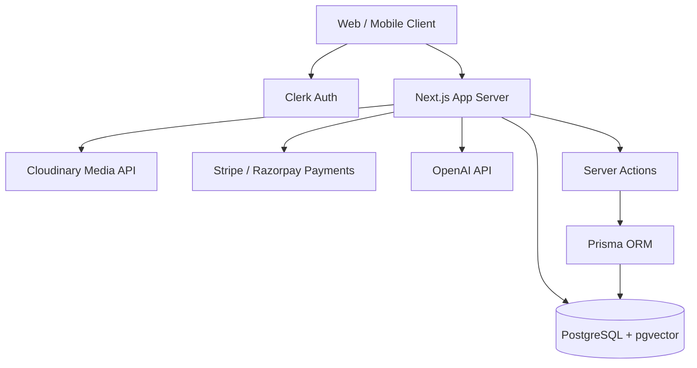
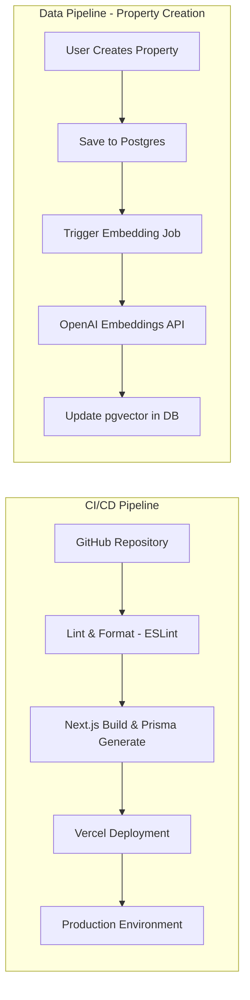

# Occupyo - System Design, Architecture & Pipeline

## 1. Executive Summary
Occupyo is a modern, full-stack real estate and commercial space management platform. It allows property owners to list spaces (warehouse, flex, office) and tenants to search, book, and lease these spaces. The platform supports complex leasing arrangements (hourly, daily, monthly), AI-powered semantic search, and integrated payments.

## 2. Tech Stack
- **Frontend Framework:** Next.js (App Router), React 19
- **Styling:** Tailwind CSS (v4), Lucide React (Icons), clsx & tailwind-merge (utility classes)
- **Database:** PostgreSQL (with `pgvector` for AI search)
- **ORM:** Prisma
- **Authentication:** Clerk
- **Media Storage:** Cloudinary
- **Payments:** Stripe & Razorpay integration
- **AI & Search:** OpenAI (for embeddings)
- **Form Management:** React Hook Form + Zod (Validation)
- **Mobile/Cross-Platform:** Capacitor (iOS/Android support)
- **Data Visualization:** Recharts

## 3. System Architecture



### Core Components:
1. **Client-side (Next.js React Server Components & Client Components):** Handles UI rendering, user interactions, and complex forms.
2. **Server-side (Next.js API Routes & Server Actions):** Handles business logic, secure database interactions, and integrations with third-party services.
3. **Database Layer (Prisma + PostgreSQL):** Manages relational data (Users, Properties, Leases, Messages) and vector embeddings for advanced search functionalities.
4. **External Services:**
   - **Clerk:** Handles secure user authentication, registration, and session management.
   - **Cloudinary:** Secures and serves user-uploaded images.
   - **Stripe/Razorpay:** Manages financial transactions and lease payments.
   - **OpenAI:** Generates vector embeddings for properties to enable semantic search capabilities.

## 4. Pipeline Architecture (CI/CD & Data Flow)

The platform requires a robust pipeline for both deployment (CI/CD) and data processing (Search/Embeddings).



### CI/CD Deployment Flow:
1. **Source Control:** GitHub is used for version control.
2. **Checks:** On Pull Request, GitHub Actions or Vercel automatically runs `eslint` and Type checking.
3. **Build:** Next.js compiles the app, Prisma generates the client, and `prisma db push` syncs the database.
4. **Hosting:** Vercel automatically hosts the Next.js frontend and serverless functions.
5. **Mobile Build:** Capacitor CLI builds Android/iOS bundles from the web output.

## 5. Codebase Structure

The project follows a standard Next.js App Router structure with a focus on feature-based organization.

```text
a:\occupyo\
├── package.json         # Dependencies and project scripts
├── prisma/
│   └── schema.prisma    # Database schema (Models: User, Property, Lease, Message, etc.)
└── src/
    └── app/             # Next.js App Router root
        ├── actions/     # Server actions (search.ts, property.ts, etc.) for DB interactions
        ├── api/         # API routes (e.g., sign-cloudinary)
        ├── dashboard/   # Authenticated user dashboards (Owner, Messages, Listings)
        ├── properties/  # Property listing and details pages
        ├── search/      # Search and discovery interfaces
        ├── sign-in/     # Clerk authentication routes
        ├── sign-up/     # Clerk authentication routes
        ├── layout.tsx   # Root layout component
        └── page.tsx     # Landing page
```

## 6. Implementation Plan & Current Status

### Phase 1: Foundation (Completed)
- [x] Project setup (Next.js, Tailwind, Prisma)
- [x] Database schema design and provisioning (PostgreSQL)
- [x] Authentication integration (Clerk)

### Phase 2: Core Features (In Progress/Completed)
- [x] Property Listing Management (Create, Read, Update, Delete)
- [x] Cloudinary integration for image uploads
- [x] Owner Dashboard UI
- [x] Search infrastructure (Semantic search with OpenAI embeddings + pgvector)

### Phase 3: Booking & Communication (Next Steps)
- [ ] Implement end-to-end lease booking flow
- [ ] Integrate Stripe/Razorpay for checkout and payment processing
- [ ] Real-time messaging system between Tenants and Owners
- [ ] Advanced tenant dashboard for managing active leases and space requests

### Phase 4: Mobile & Polish
- [ ] Wrap application with Capacitor for iOS and Android deployment
- [ ] Performance optimization and SEO
- [ ] Comprehensive testing (Unit & E2E)
